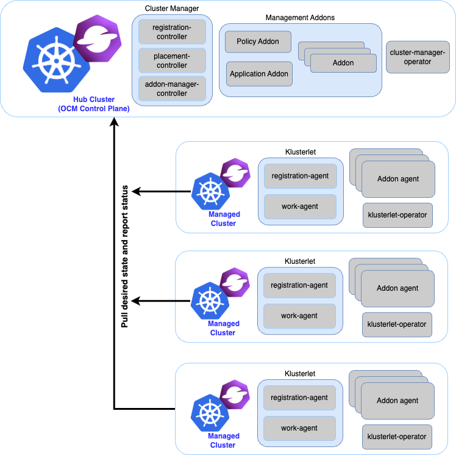
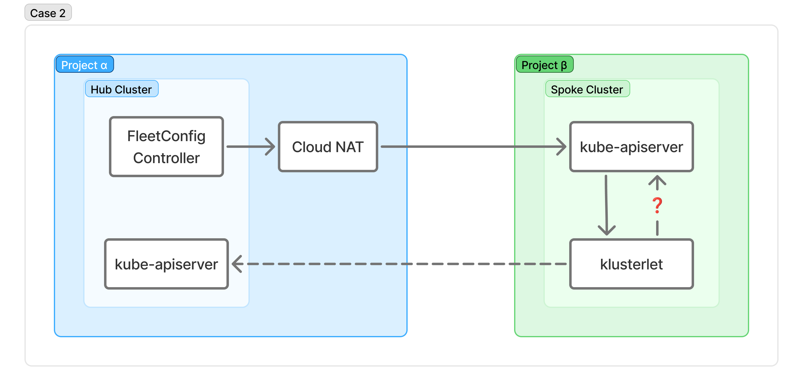
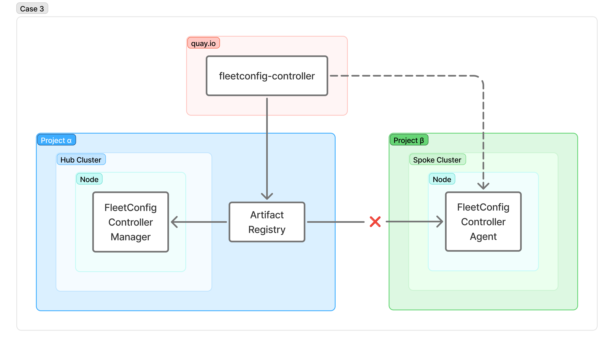
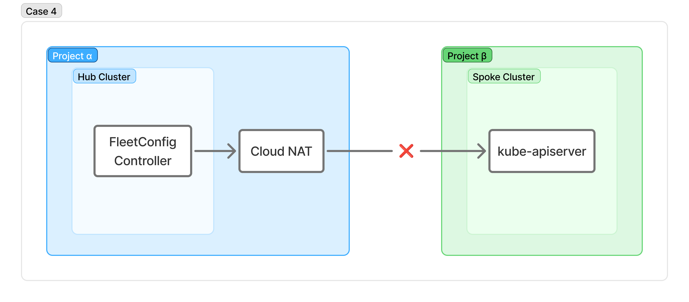
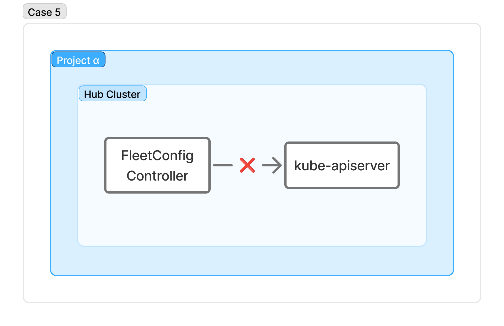

> This is an English translation of my article originally published in Japanese on Zenn: [GKE に Open Cluster Management (OCM) を導入するのにハマったことメモ](https://zenn.dev/aishift/articles/050045247128e9).

Hi, I'm [@key60228](https://twitter.com/key60228).

In the Kubernetes and Cloud Native world, multi-cluster operations have been getting more and more attention lately, alongside AI workloads.

There were several sessions on the topic at KubeCon + CloudNativeCon Japan 2026 as well. (The first one below is essentially a "don't go multi-cluster lightly" talk.)





In this post I'll go over the issues I ran into while rolling out [Open Cluster Management (OCM)](https://open-cluster-management.io/), which the second session mentions, together with its add-on [FleetConfig Controller](https://open-cluster-management.io/docs/getting-started/integration/fleetconfig-controller/), on GKE.

## What is Open Cluster Management (OCM)?

I'll skip the details, but in short, it's a project for managing multiple Kubernetes clusters from one place.

https://github.com/open-cluster-management-io

It was originally started by Red Hat, donated to the CNCF in 2021, and is currently a Sandbox project.[^1]

It uses a hub-spoke architecture. The hub cluster holds the desired state for each spoke cluster, and an agent on the spoke called the Klusterlet pulls that state and applies it.


*Source: https://open-cluster-management.io/docs/concepts/architecture/*

The desired state is defined in a `ManifestWork` resource, and each spoke cluster is represented by a `ManagedCluster` resource.

The Klusterlet treats every `ManifestWork` in the `Namespace` that shares its `ManagedCluster`'s name as its own desired state and applies it.

## What is FleetConfig Controller?

OCM has an [add-on](https://open-cluster-management.io/docs/concepts/add-on-extensibility/addon/) mechanism for extending its functionality, and FleetConfig Controller is one of the officially provided add-ons.



According to the [docs](https://open-cluster-management.io/docs/getting-started/installation/), the de facto standard way to set up OCM is the [clusteradm](https://github.com/open-cluster-management-io/clusteradm) CLI. FleetConfig Controller wraps those clusteradm operations behind two custom resources, `Hub` and `Spoke`.

The `Hub` CR takes over what `clusteradm init` does (initializing the hub cluster), and the `Spoke` CR takes over what `clusteradm join` does (registering a spoke cluster as a `ManagedCluster`).

We already run Argo CD as part of the platform at my company, AI Shift, and wanted to stay as close to GitOps as possible. We also wanted to cut down on the toil of adding spoke clusters and upgrading things like the Klusterlet on existing spokes. So we decided to give it a try.

## The environment

| Item | Details |
| --- | --- |
| Hub cluster | GKE on Project α (Standard mode, private nodes, public endpoint enabled) |
| Spoke cluster | GKE on Project β (Standard mode, private nodes, public endpoint enabled) |

FleetConfig Controller and the Hub / Spoke CRs are deployed to the hub cluster as a Helm chart via Argo CD.

## Setup flow

The overall procedure looks like this:

1. Install FleetConfig Controller on the hub cluster
2. Create the Hub CR
3. Create a bootstrap kubeconfig for the spoke cluster and register it on the hub as a Secret
4. Create the Spoke CR
5. Once the join completes, delete the bootstrap resources

The only real difference from the [kind-based quick start](https://github.com/open-cluster-management-io/lab/tree/main/fleetconfig-controller#%E2%80%8D%EF%B8%8F-quick-start) is that you build the bootstrap kubeconfig yourself. Nothing special beyond that.

## Gotchas

### 1. clusteradm join fails with i/o timeout


After creating the Spoke CR, its PHASE stayed at `Unhealthy` and the status showed this error:

```
clusteradm join command failed for spoke spoke-1: exit status 1, output:
W0821 12:32:43 exec.go:250] Join continues without an external API server URL for the klusterlet because :
Get "https://xxx.xxx.xxx.xxx/api/v1/namespaces/kube-public/configmaps/cluster-info": dial tcp xxx.xxx.xxx.xxx:443: i/o timeout
...
Error: Get "https://xxx.xxx.xxx.xxx/apis/apps/v1/namespaces/open-cluster-management/deployments/klusterlet": dial tcp xxx.xxx.xxx.xxx:443: i/o timeout
```

`xxx.xxx.xxx.xxx` is the spoke's public endpoint.

The `clusteradm join` equivalent is run by the controller on the hub, which talks directly to the spoke's kube-apiserver. So something on the path from hub to spoke was blocking the connection.

The cause was that `gcp_public_cidrs_access_enabled` ("Access using Google Cloud public IP addresses") was set to `false` on the spoke GKE cluster.

When this setting is `false`, access from Google Cloud public IP ranges is rejected even if you put `0.0.0.0/0` in the master authorized networks.[^2]

Connections from the hub come from its Cloud NAT IP, which is a Google Cloud public IP, so they were being dropped right there.

### 2. The Hub CR needs spec.apiServer



Once the network was fixed, the join itself went through, but the Spoke CR then got stuck at `Joining`. The klusterlet registration-agent on the spoke kept logging this error:

```
Get "https://10.2.0.1:443/apis/cluster.open-cluster-management.io/v1/managedclusters/spoke-1-ab513522":
tls: failed to verify certificate: x509: certificate signed by unknown authority
```

`10.2.0.1` is an in-cluster ClusterIP.

If the kubeconfig setting on the Hub CR is just `inCluster: true`, the "hub API server URL" that FleetConfig Controller hands to the spoke cluster also ends up being the in-cluster address.

From the spoke cluster's point of view, `https://10.2.0.1` is its own kube-apiserver, so the certificate can't be verified against the hub's CA and you get a TLS error.

On kind (kubeadm), the `kube-public/cluster-info` ConfigMap exists, so FleetConfig Controller can "helpfully" fill in the hub's endpoint and pass it to the spoke. GKE doesn't have that ConfigMap, so the hub endpoint has to be set explicitly.

Setting the hub cluster's endpoint in `spec.apiServer` on the Hub CR fixed it.

### 3. Only fleetconfig-controller-agent goes into ImagePullBackOff



After the ManagedCluster reached `JOINED=True / AVAILABLE=True` and all the klusterlet Pods were Running, the fleetconfig-controller-agent on the spoke cluster, and only that Pod, went into `ImagePullBackOff`.

```
Failed to pull image "asia-northeast1-docker.pkg.dev/<HUB_PROJECT>/remote-quay-io/open-cluster-management/fleetconfig-controller:v0.3.5@sha256:...":
... 403 Forbidden
```

In our setup, the hub cluster pulls quay.io images through an Artifact Registry remote repository.

For the klusterlet images (operator / registration / work), I had already overridden the references via `spec.klusterlet.values.images.overrides` to point directly at quay.io. The fleetconfig-controller-agent image, however, has to be overridden through a different path.

Because I had missed that override, the hub-side Helm chart's `image.repository` was written into the AddOnTemplate. The spoke cluster's nodes then tried to pull from the Artifact Registry in the hub's Google Cloud project, had no permission, and got a 403.

The fix was to set `spec.addOns[].deploymentConfig.registries.source` to the hub's Artifact Registry and `spec.addOns[].deploymentConfig.registries.mirror` to the public quay.io repository.

### 4. Unauthorized due to an expired bootstrap token



After spending a while on the issues above, I tried the join again and got yet another error:

```
clusteradm join command failed for spoke spoke-1: exit status 1, output:
W0824 01:54:54 exec.go:250] Join continues without an external API server URL for the klusterlet because : Unauthorized
Error: Unauthorized
```

This one was simple: I had given the bootstrap kubeconfig token a short lifetime, and it had just expired.

Reissuing the token and replacing the Secret fixed it.

### 5. ClusterRoleBinding error from the webhook



At some point, the FleetConfig Controller Pod went into `CrashLoopBackOff` and kept crashing.

The fleetconfig-controller-manager logs showed this:

```
2026-08-28T07:28:00Z       ERROR   setup   problem running manager {"error": "failed to create or update global ManagedClusterSetBinding: admission webhook \"managedclustersetbindingvalidators.admission.cluster.open-cluster-management.io\" denied the request: managedclustersets/bind.apps \"global\" is forbidden: user \"system:serviceaccount:fleetconfig-system:fleetconfig-controller-manager\" is not allowed to bind cluster set \"global\""}
```

The cause was that I had created the Hub CR once in the `γ` namespace, then moved it to a different namespace, `δ` (by deleting and recreating it).

By default, the FleetConfig Controller Helm chart bundles the OCM CRDs and creates a `ManagedClusterSet` and `ManagedClusterSetBinding` at startup.

On the other hand, deleting the Hub CR runs `clusteradm clean` under the hood, which also deletes the OCM CRDs.

Deleting a CRD deletes its CRs too,[^3] so the `ManagedClusterSetBinding` that FleetConfig Controller had created was gone.

When the FleetConfig Controller Pod later restarted, it tried to recreate the `ManagedClusterSetBinding`, but because of a missing RBAC rule, the admission webhook's `SubjectAccessReview` returned Forbidden.

On the very first startup, the Hub CR hadn't been initialized yet and the validating webhook didn't exist, so the request skipped the RBAC check and the controller came up fine.

For now I worked around it by defining the ClusterRole / ClusterRoleBinding explicitly on our side.

```yaml
apiVersion: rbac.authorization.k8s.io/v1
kind: ClusterRole
metadata:
  name: fleetconfig-controller-clusterset-bind
rules:
  - apiGroups:
      - cluster.open-cluster-management.io
    resources:
      - managedclustersets/bind
    resourceNames:
      - default
      - global
      - spokes
    verbs:
      - create
---
apiVersion: rbac.authorization.k8s.io/v1
kind: ClusterRoleBinding
metadata:
  name: fleetconfig-controller-clusterset-bind
roleRef:
  apiGroup: rbac.authorization.k8s.io
  kind: ClusterRole
  name: fleetconfig-controller-clusterset-bind
subjects:
  - kind: ServiceAccount
    name: fleetconfig-controller-manager
    namespace: fleetconfig-system
```

(I also sent a fix upstream and it has been merged, so this shouldn't happen in future releases.)



## Wrapping up

That's the list of things that tripped me up while getting OCM / fleetconfig-controller running on GKE.

I had done a fair amount of testing locally on kind beforehand and figured it would go smoothly, but there were more differences than I expected.

Hopefully this helps anyone who is stuck, or about to get stuck, with the same setup. (If anyone out there is!)

[^1]: [How to distribute workloads using Open Cluster Management - Red Hat Developer Blog](https://developers.redhat.com/articles/2023/01/19/how-distribute-workloads-using-open-cluster-management)

[^2]: [About network isolation in GKE - Google Cloud Docs](https://docs.cloud.google.com/kubernetes-engine/docs/concepts/network-isolation#how_authorized_networks_work)

[^3]: [Extend the Kubernetes API with CustomResourceDefinitions - Kubernetes Documentation](https://kubernetes.io/docs/tasks/extend-kubernetes/custom-resources/custom-resource-definitions/#delete-a-customresourcedefinition)
